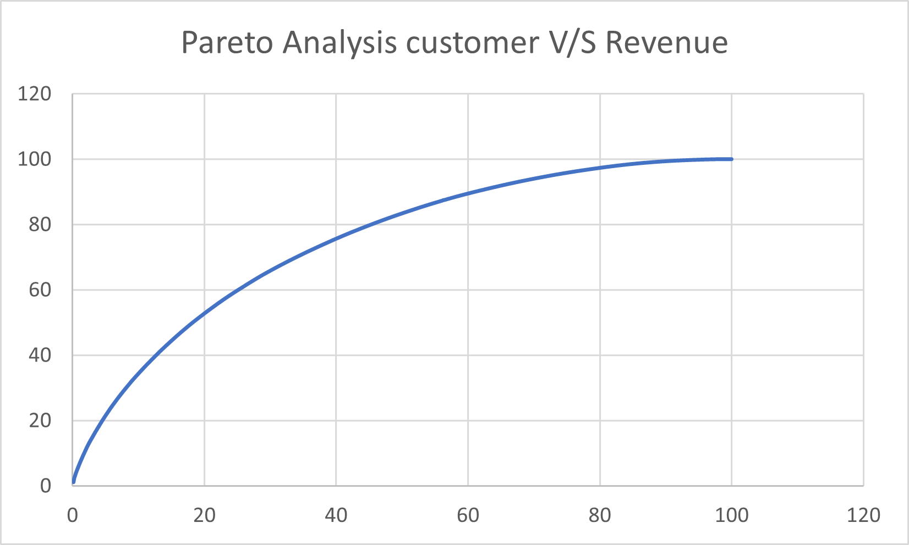

# Data-Analytics-Project
# Sales & Customer Analytics Project

## Project Overview:

This project analyzes sales performance, customer behavior, product trends, and sales target achievement from 2018 to 2021. The objective is to extract actionable insights to support data-driven business decisions and optimize regional strategies.
---

# Tools and Technologies:

**PostgreSQL** - For data extraction and analysis using SQL queries.

**Microsoft Excel** - For data visualization and supplementary analysis.
---

# Datasets Used:

**Orders** : Transactional sales details including order date, quantity, discounts, profits, etc.

**Customers**: Customer identification and details.

**Products**: Product categories, sub-categories, and names.

Returns: Information on product returns.

SalesTarget: State-wise monthly sales targets.

SalesPerson: Information on sales representatives.

Region: Information of Region and their respective heads.

Project Objectives:

Examine revenue and profit trends over time and across product categories.

Identify high-performing customers and products through RFM (Recency, Frequency, Monetary) segmentation.

Analyze sales target achievement by state and month.

Understand return patterns and their impact on revenue.

Provide insights to improve business growth and regional performance.

Key Analysis Highlights:

Total revenue was 11,488,064.20 with a profit margin of 12.45% on 5,009 orders.

Seasonal and yearly sales trends indicate growth patterns and periods of fluctuation.

Customer segments show distinct profitability and purchase behaviors.

Pareto analysis revealed that the top 20% of customers contribute nearly 50% of revenue.

The West region dominates order volume and revenue, while the South region consistently underperforms against sales targets.

The Office Supplies category has the highest and fastest-growing product return rates.

Business Insights and Recommendations:

Strengthen retention strategies focused on high-value customer segments.

Investigate and address return issues, especially in the Office Supplies category.

Enhance sales efforts in underperforming regions such as the South.

Reassess discount and pricing policies to improve profitability.

Leverage SQL-based analytics to continuously monitor trends and guide strategic decisions.

How to Use This Repository:

SQL query files contain the scripts used for data extraction and analysis.

Data files are provided for replication and further analysis.

Visualizations and summary reports can be used to communicate findings to stakeholders.
